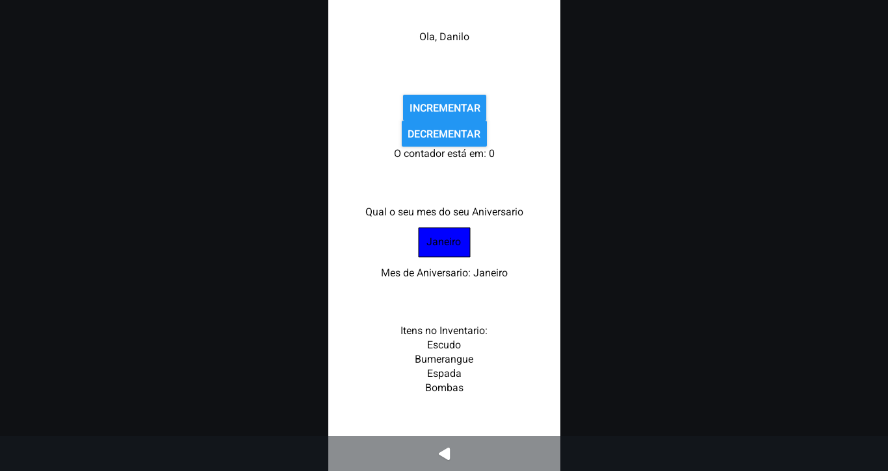

# Exercícios Slide 1 

## Objetivos dos Exercícios

### Exercício 1

Criar um componente funcional que aceita um nome como prop e exibe uma mensagem de saudação.

### Exercício 2

Implementar um componente Counter que exibe um número (inicialmente 0) e dois botões para incrementar e decrementar o valor. Utilize o hook useState.

### Exercício 3

Criar um componente que inclui um <TextInput> para entrada de texto e um <Text> para exibir o texto digitado. Use useState para armazenar e atualizar o valor do texto.

### Exercício 4

Desenvolver um componente que renderiza uma lista de itens (<Text>) a partir de um array de strings. Utilize .map() para criar os elementos da lista dinamicamente.

---

### Resultado dos Exercícios



---

## Tecnologias Utilizadas

- Visual Studio Code  
- Node.js (NPM)  
- React Native (Expo)  
- JavaScript

---

## Como executar o projeto

### 1. Clone o repositório

```bash
git clone https://github.com/seu-usuario/seu-repo.git
cd seu-repo/Exercicios/exercicios5
```

### 2. Instale as dependências do projeto React

```bash
npm install
```

### 3. Inicie o JSON Server

Você precisa de um arquivo `db.json` com a estrutura dos alunos. Exemplo:

```json
{
  "alunos": [
    {
      "id": 1,
      "nome": "Maria da Silva",
      "matricula": "12345"
    }
  ]
}
```

E então execute o servidor:

```bash
npx json-server --watch db.json --port 3000
```

### 4. Inicie o projeto React

Em outro terminal:

```bash
npm run dev
```

---

## Estrutura dos Arquivos

```
ExerciciosSlides01/
├─ .expo/
│  ├─ devices.json
│  └─ README.md
├─ assets/
│  ├─ adaptive-icon.png
│  ├─ favicon.png
│  ├─ icon.png
│  └─ splash-icon.png
├─ img/
│  └─ exercicios.png
├─ src/
│  └─ components/
│     ├─ Exercicio1.js
│     ├─ Exercicio2.js
│     ├─ Exercicio3.js
│     └─ Exercicio4.js
├─ .gitignore
├─ App.js
├─ app.json
├─ index.js
├─ package-lock.json
├─ package.json
└─ README.md
```

## Autor

**Danilo Pereira** – [@d4nkali](https://github.com/d4nkali)
